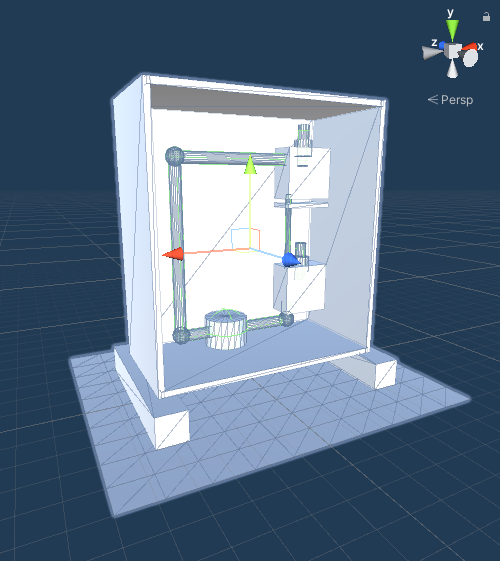

Getting introduced into the world of augmented reality for industrial applications can be as much thrilling as it can be daunting. This is no different when it comes to the Unity cross-platform game engine which is currently the most used solution for the development of augmented reality applications in industry and beyond. For this course we looked to accomplish two goals at once by first explaining participants the possibilities of augmented reality to then enable them to create their first AR app during a two-day workshop.

First participant's result

The training course starts with a morning of explaining the use of Augmented Reality, how this can be applied to industry and which tools we will be using throughout the course. The goal is to end with an Augmented Reality application that uses plane detection, object placement, interactable elements and IoT data display. The image above shows the successful end-result of the first training course given in the summer of 2022.

In order to enable a participant to complete the course with success we have to teach them numerous aspects of software development. A first start is made with Azure Devops as this is where the course instructions can be found. There is a main repository which functions as the information hub. This is where the instructions are written in the README.md, but also where the final solution can be found and needed unitypackages. These packages contain crucial scripts but also function as checkpoints for if a participant cannot keep up with the group. Each participant also has their own repository which is used to version control their work and share it with the teacher. The use of Git would normally be considered an overkill for a two-day course, however, it is crucial in this case. Everyone is equipped with a Windows laptop and an iPad, sadly it is not possible to install apps onto an iPad from a Windows machine. Hence, whenever a participant finishes a build it is shared with the teacher through their respective repository (besides MacBooks for all participants, the use of USBs is a big no-no) this is then used to build the app using a dedicated MacBook.

When it comes to introducing Unity, we have found that it is best to take a paced but engaging approach. The main windows and their functionality are first explained through some text only to reinforce the participant's understanding through a relevant activity. Once the basics are explained ranging from the hierarchy window to components, the participant is tasked to re-create the test-rig in Unity using just primitives.

Example test-rig using primitives

This activity tries to give a sense of self-efficacy among the participants through the creation of something tangible. Everyone will have a different take on how the physical test-rig can be re-created it allows their creative side to shine through resulting in wildly different creations. Due to the freedom given here it can result in participants progression to diverge. To overcome this issue there is a so-called "checkpoint", the participant can easily continue with the course using a pre-made test-rig (seen above).

From here onwards we teach how to make use of the ARKit package and how to implement it in your application. Especially with such activities, it is relatively easy to make errors which can be difficult to traceback. Therefore, it is important for the activities to be intuitive and the instructions well written. Through a combination of centralized technical explanations and activities that visualize certain GameObject behaviours we guide the participant through numerous ambiguous components needed to make AR work in Unity. Giving the participant an understanding of what happens in the background is essential to retain engagement. This becomes especially prevalent when it comes to plane detection as it requires many steps without any intrinsic explanation of what will happen once finished.

Teaching this course required me to create and review the material whilst identifying key concepts that need to be conveyed. Organizing the content in a coherent and logical manner, and then presenting it in a way that can be understood by others regardless of their prior understanding has challenged my own understanding of the technology at hand. Having given a number of courses now I feel like I've learned as much as I've taught. My understanding has deepened through numerous activities such as creating the course material, answering difficult questions and fixing obscure errors all whilst enjoying the experience of teaching others.
