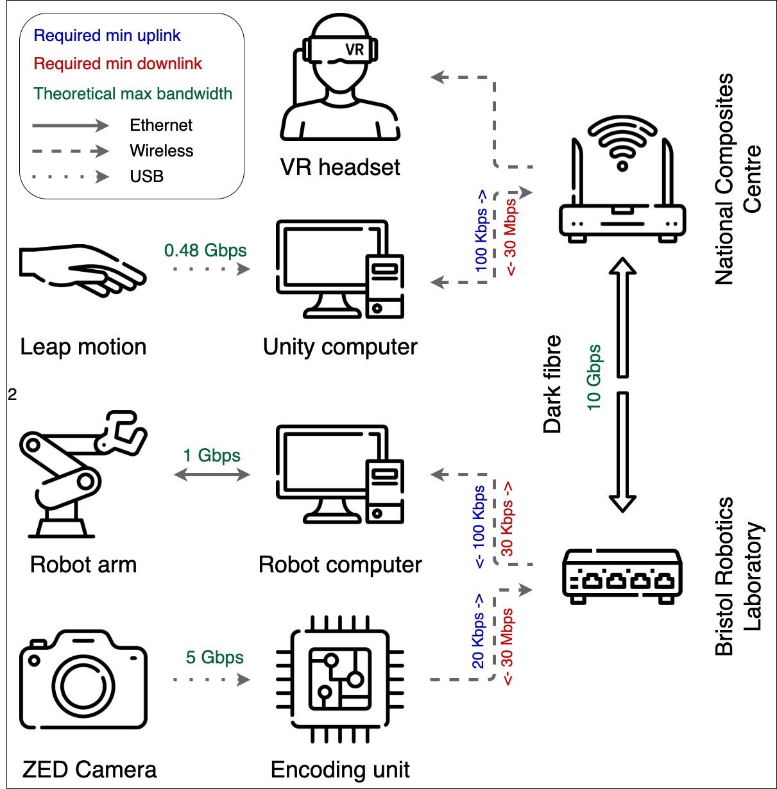

## The project

The field of robotics is constantly evolving, and with advancements in technology, we are now able to remotely control robots from a distance. This is known as teleoperation, and it has a wide range of applications in industry, from hazardous environments to complex tasks that are too difficult or precarious for automation. In this work, we explored a teleoperation solution where an industrial robot is controlled from a remote location, using haptic robot control protocols, hand tracking, and an immersive experience to provide an intuitive and effective way to operate the robot.

<iframe width="560" height="315" src="https://www.youtube.com/embed/HwdP8x07LTY" title="YouTube video player" frameborder="0" allow="accelerometer; autoplay; clipboard-write; encrypted-media; gyroscope; picture-in-picture; web-share" allowfullscreen></iframe>

## Haptics

To mitigate project risk, an initial study was undertaken where the operation of the robot arm was completely virtual, proving that haptic control of an industrial robot arm is indeed feasible (click here for more information). For the hand tracking an [Ultraleap motion controller](https://www.ultraleap.com/product/leap-motion-controller/) was used. The operator places his/her hand above the sensor and the dual infrared cameras are able to track the position of the hand in real-time. A haptic control protocol would translate this motion into movement of the robot's tool-centre-point.

## Immersive experience

For teleoperation to work we need to give the operator a good understanding of what is happening in the environment of the robot arm. An immersive environment was created to tackle this challenge. The immersive environment was enabled through the use of the ZED stereo camera and the Oculus Quest 2 Virtual Reality headset. This immediately gave the operator a sense of depth which proved to be extremely beneficial for the pick-and-place task.

Menu screen in VR

## Robot arm

In this robot teleoperation system, the robot is divided into two parts: the virtual and the physical element. The virtual part of the system simulates the robot arm, and it is realized using Unity. This software not only visualizes the robot arm but also performs the inverse kinematics calculations, which determine the robot's joint angles based on a given tool center point.

Franka Emika robot arm in Unity

The calculated joint angles are then transmitted to an Ubuntu machine using a Transmission Control Protocol (TCP) connection. This machine runs the Robot Operating System (ROS) and communicates directly with the physical robot arm, allowing for precise and accurate control.

## Networking

By first testing the network and the solution using a cable, the feasibility of 5G was proven in a short time frame.

Network diagram of demonstrator

## Future work

- Change inverse kinematics model to ROS based
- Improve receiver code on robot side for smoother robot movement
