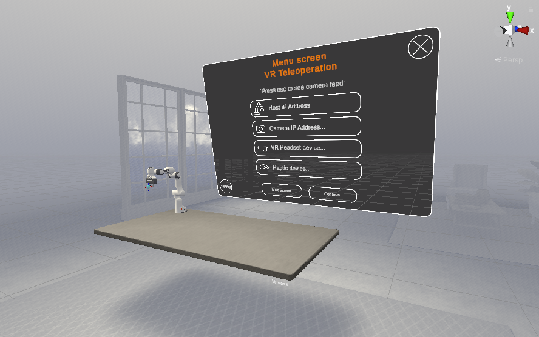
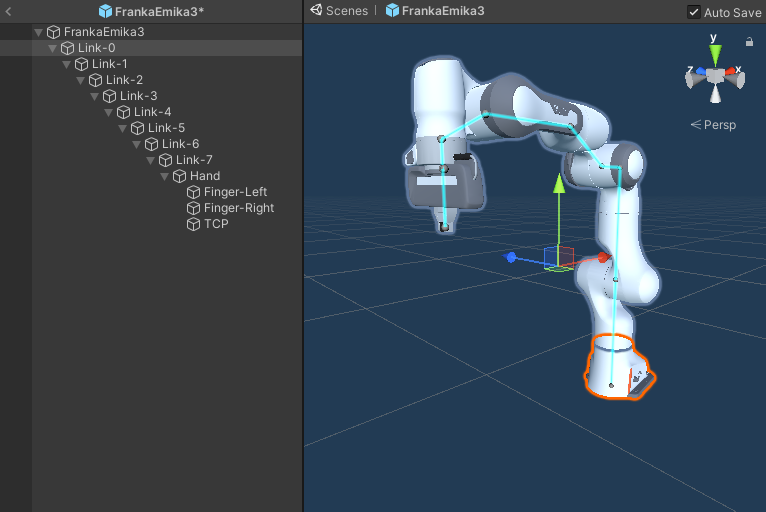
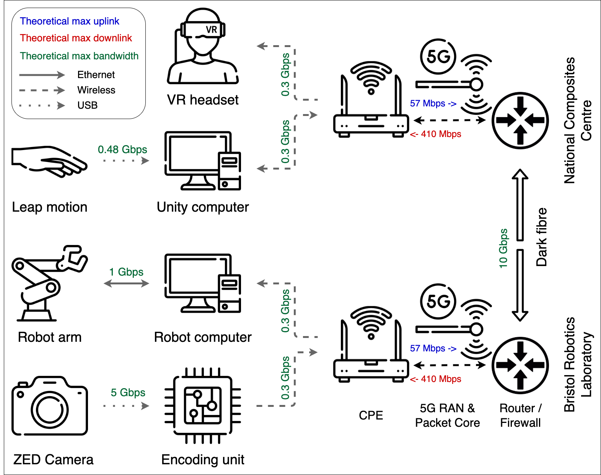
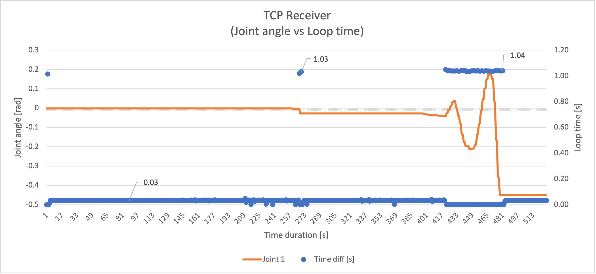

## The project

The field of robotics is constantly evolving, and with advancements in technology, we are now able to remotely control robots from a distance. This is known as teleoperation, and it has a wide range of applications in industry, from hazardous environments to complex tasks that are too difficult or precarious for automation. In this work, we explored a teleoperation solution where an industrial robot is controlled from a remote location, using haptic robot control protocols, hand tracking, and an immersive experience to provide an intuitive and effective way to operate the robot.

<iframe width="560" height="315" src="https://www.youtube.com/embed/HwdP8x07LTY" title="YouTube video player" frameborder="0" allow="accelerometer; autoplay; clipboard-write; encrypted-media; gyroscope; picture-in-picture; web-share" allowfullscreen></iframe>

## Haptics

To mitigate project risk, an initial study was undertaken where the operation of the robot arm was completely virtual, proving that haptic control of an industrial robot arm is indeed feasible (click here for more information). For the hand tracking an [Ultraleap motion controller](https://www.ultraleap.com/product/leap-motion-controller/) was used. The operator places his/her hand above the sensor and the dual infrared cameras are able to track the position of the hand in real-time. A haptic control protocol would translate this motion into movement of the robot's tool-centre-point.

## Immersive experience

For teleoperation to work we need to give the operator a good understanding of what is happening in the environment of the robot arm. An immersive environment was created to tackle this challenge. The immersive environment was enabled through the use of the ZED stereo camera and the Oculus Quest 2 Virtual Reality headset. This immediately gave the operator a sense of depth which proved to be extremely beneficial for the pick-and-place task.

Menu screen in VR

## Robot arm

In this robot teleoperation system, the robot is divided into two parts: the virtual and the physical element. The virtual part of the system simulates the robot arm, and it is realized using Unity. This software not only visualizes the robot arm but also performs the inverse kinematics calculations, which determine the robot's joint angles based on a given tool center point.

Franka Emika robot arm in Unity

The calculated joint angles are then transmitted to an Ubuntu machine using a Transmission Control Protocol (TCP) connection. This machine runs the Robot Operating System (ROS) and communicates directly with the physical robot arm, allowing for precise and accurate control.

## Networking

One of the key advantages of 5G technology is its ability to provide faster, more reliable, and more efficient wireless connectivity than ever before. This will be particularly important in a teleoperation setting, where the robot will be controlled remotely by a human operator. With 5G, the operator will be able to control the robot wirelessly in real-time, with minimal latency and high-quality video and audio feedback.

To test and benchmark the solution, a cabled network was used to facilitate the teleoperation. The network consisted of an optical fibre between locations whilst CAT 6 Ethernet was used for the computer connections which was limited to 1 Gbps due to the network cards. During testing, the maximum data throughput was measured at 27 Mbps. With the current 5G networking capability supplied by Zeetta networks, the network can have an uplink of 57 Mbps and a downlink of 410 Mbps, indicating that 5G could be integrated within the current solution.

Network diagram of demonstrator

## Future work

### &#9900; Inverse kinematics

Current inverse kinematics solution uses an available inverse kinematics Asset found in the Unity asset store. This performs adequately within the needs of the research project, however, some concessions had to be made. A 7-DOF robot arm is prone to workspace-interior singularities due to its redundant joint. This generally occurs when two joint axis line up forming an infinite number of solutions. The out-of-the-box inverse kinematics solution used is not able to handle these accordingly and therefore is likely to behave erratically upon arriving at a singularity point.

A way around this would be to integrate ROS into the used solution. We can run ROS within a docker environment effectively simulating the robot and through the new [ROS-TCP-Connector](https://github.com/Unity-Technologies/ROS-TCP-Connector) it is possible to send commands from a ROS Node to Unity. This would result in the visualization relying on a more accurate and realistic model of the robot arm.

### &#9900; TCP receiver side

A very visual issue that the teleoperation system currently has is the "choppy" robot movement. Instead of following the path smoothly similar to as is done virtually the robot moves from point to point. The root-cause of this issue can be found in the TCP receiver code.

On the receiver side of the TCP connection there is a so-called "robot computer" which receives the messages and requests the robot to move accordingly. It was found that the C++ code would request the robot to move and per default give it one second to do so. This means that it does not matter to what degree the robot has to move it will always take one second to perform the movement (unless exceeding rotation speeds). Below is a diagram that further proofs this hypothesis. The time it takes to loop through the C++ code jumps to one second everytime a movement is requested regardless the distance.

The C++ TCP receiver side code was supplemented by the lab and it was considered to be out-of-scope for the 5G project to solve this issue. However, solving it would mean that the robot's movements are more predictable improving the teleoperation system.
